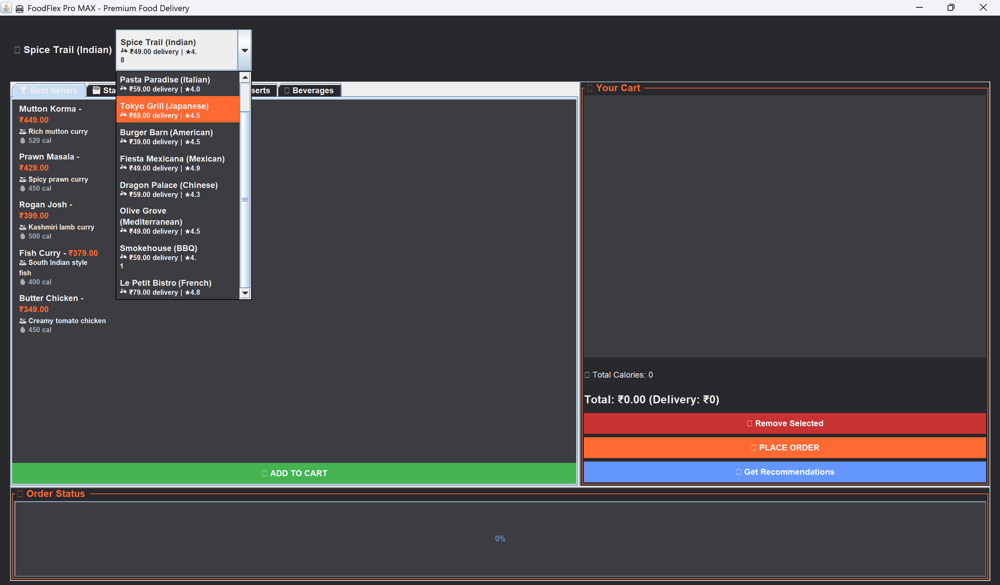
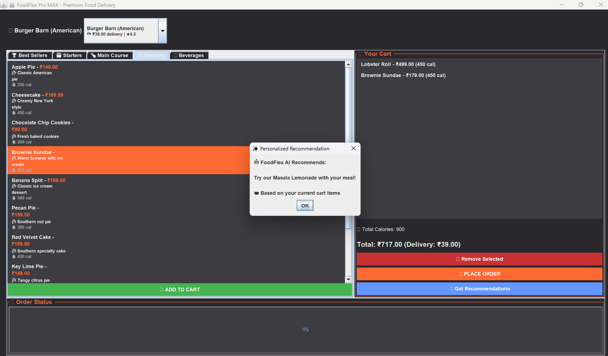
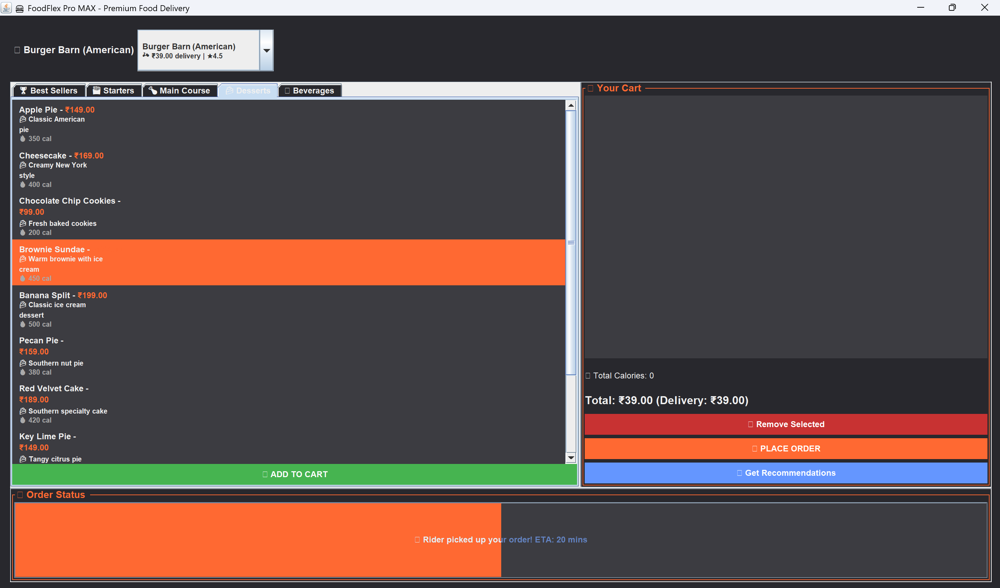

# FoodFlexProMax 🍽️

FoodFlexProMax is a smart food ordering system built with Java, designed to make food ordering simple, interactive, and efficient. Users can browse restaurants, get random food suggestions, add items to their order, and complete the checkout process seamlessly.

## ✨ Features
- Select restaurants from the available list
- Get random food suggestions  
- Add multiple items to the cart
- Place and confirm orders
- User-friendly interface with a smooth flow

## 📸 Screenshots
| Select Restaurant | Random Suggestions | Add Items | Place Order |
|-------------------|-------------------|-----------|-------------|
|  |  |  |  |

## 🛠️ Tech Stack
- **Language:** Java
- **Concepts:** Object-Oriented Programming (OOP), File Handling, Exception Handling
- **Platform:** Java SE

## 📁 Project Structure
 **FoodFlexProMAX.java** - Main Java file with core logic
- **Screenshots/** - Folder containing app screenshots
  - select_resturant.png
  - suggestions.png  
  - adding_items.png
  - placing_order.png
- **README.md** - This documentation file

## 🚀 How to Run
1. Clone the repository:
```bash
git clone https://github.com/Ramyasai07/FoodFlexProMax.git
cd FoodFlexProMax
javac FoodFlexProMAX.java
java FoodFlexProMAX
🔮 Future Enhancements
Integrate with a real database

Add GUI for better user experience

Implement online payment system

Recommendation system based on past orders
Author
Ramya Sai
B.Tech Student | Software Developer Enthusiast
[GitHub](https://github.com/Ramyasai07) | [LinkedIn](https://linkedin.com/in/ramya-sai-pera)
